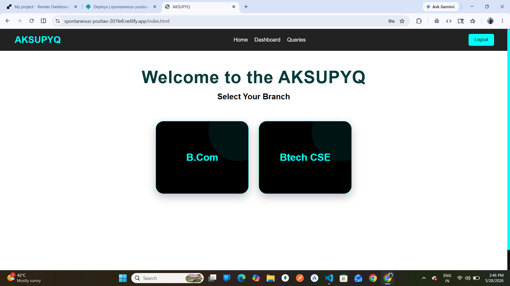
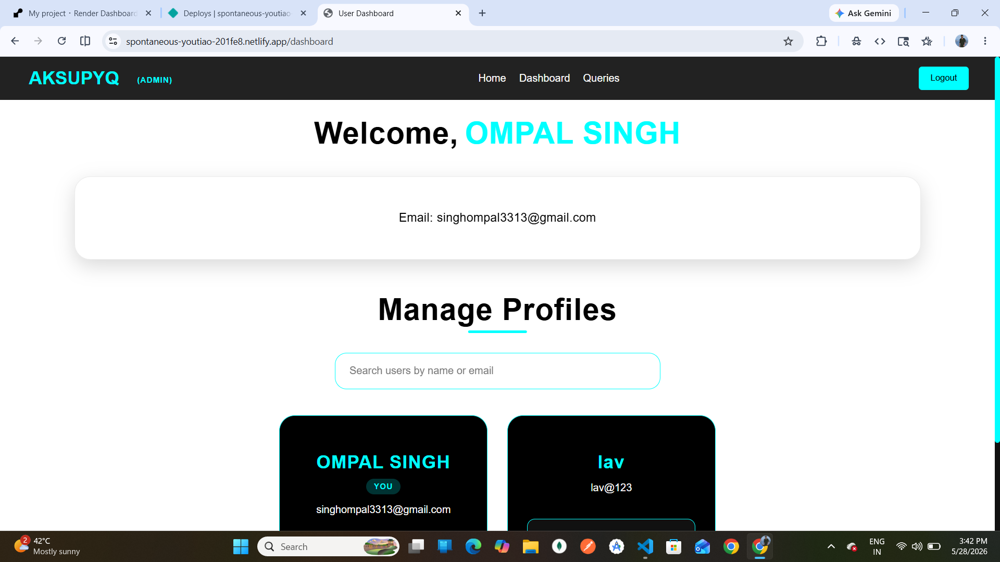
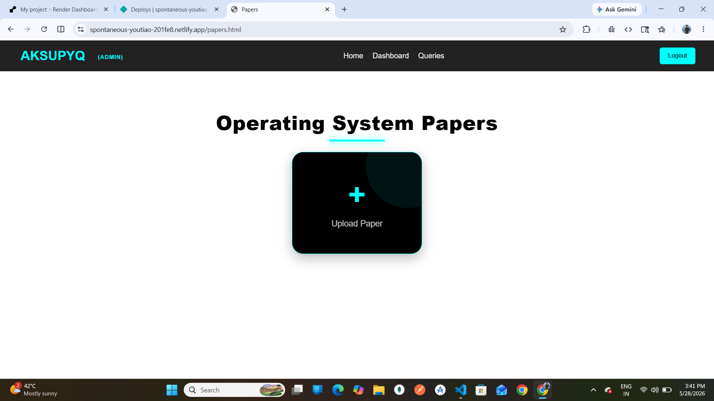

# AKSUPYQ 🚀

AKSUPYQ is a Full-Stack Role-Based Question Paper Management Platform built to help students access and manage previous year question papers in an organized and user-friendly way.

The platform provides a structured Branch → Subject → Papers hierarchy while also offering a secure admin dashboard for managing users, subjects, branches, papers, and student queries.

---

## 🌐 Live Demo

### Frontend

[Live Demo](https://spontaneous-youtiao-201fe8.netlify.app)

### Backend

[Backend API](https://aksupyq-backend.onrender.com)

---

## 🏗️ Project Architecture

Frontend (Netlify)
↓
Backend API (Render)
↓
MongoDB Atlas Database


## 🔥 Features

### 👨‍🎓 User Features

* User Registration & Login
* JWT Authentication
* Browse Branches & Subjects
* Download Previous Year Papers
* Send Queries to Admin
* View Solved Queries
* Responsive Mobile-Friendly UI

### 👨‍💻 Admin Features

* Admin Dashboard
* Add/Edit/Delete Branches
* Add/Edit/Delete Subjects
* Upload/Delete Papers
* Manage Users
* Change User Roles
* Solve/Delete Queries
* Protected Admin Accounts
* Automatic User Data Cleanup

---

## 🛠️ Tech Stack

### Frontend

* HTML
* CSS
* JavaScript

### Backend

* Node.js
* Express.js

### Database

* MongoDB Atlas

### Deployment

* Render
* Netlify

### Other Tools & Libraries

* JWT Authentication
* Multer
* Mongoose
* CORS

---

## 📸 Screenshots

### Home Page


### Admin Dashboard



### Papers Page



---

## ⚙️ Installation & Setup

### Clone Repository

```bash
git clone https://github.com/ompalsingh1/AKSUPYQ.git
```

---

### Backend Setup

```bash
cd Backend
npm install
npm start
```

---

### Frontend Setup

Open `index.html` using Live Server or deploy using Netlify.

---

## 🔑 Environment Variables

Create a `.env` file inside Backend folder:

```env
MONGO_URI=your_mongodb_connection_string

JWT_SECRET=your_secret_key
```

---

## 🚀 Deployment

### Frontend Deployment

Deployed using Netlify

### Backend Deployment

Deployed using Render

### Database Hosting

MongoDB Atlas

---

## 📚 What I Learned

This project helped me gain practical experience in:

* Full-Stack Development
* REST APIs
* Authentication & Authorization
* Cloud Deployment
* Database Design
* File Upload Handling
* Responsive UI Design
* Backend Security
* Debugging Real Production Issues

---

## 🔮 Future Improvements

* Payment Integration
* Cloud File Storage (AWS S3 / Cloudinary)
* Search & Filter System
* Notifications
* Dark Mode
* Better Analytics Dashboard

---

## 👨‍💻 Developer

Ompal Singh

GitHub:
[GitHub](https://github.com/ompalsingh1)

LinkedIn:
[LinkedIn](https://www.linkedin.com/in/ompal-singh-9b9965368)

---

## ⭐ Support

If you liked this project, consider giving it a ⭐ on GitHub.
